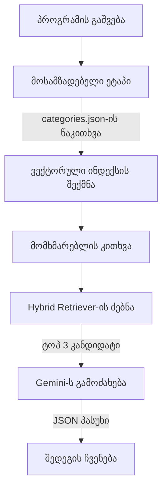

# Scrap.py — Workflow

## სისტემის მუშაობის ეტაპები

### მოსამზადებელი ფაზა (ერთჯერადი)
1. **მონაცემების ჩატვირთვა** — პროგრამა კითხულობს `categories.json`-ს და იგებს, რა კატეგორიები აქვს.
2. **ვექტორული ინდექსის აგება** — AI მოდელი (SentenceTransformer) ყველა ქვეკატეგორიის აღწერას გარდაქმნის მათემატიკურ "ანაბეჭდად" (ვექტორად) და ქმნის სწრაფ საძიებო ინდექსს.

### საბრძოლო რეჟიმი (ყოველი მოთხოვნისას)
1. **HybridRetriever.search** — მომხმარებლის კითხვაზე სისტემა ატარებს:
   - სემანტიკურ ძებნას (აზრობრივი მსგავსება)
   - საკვანძო სიტყვების ძებნას (ზუსტი დამთხვევა)
   - აერთიანებს შედეგებს და არჩევს ტოპ 3 კანდიდატს
2. **Gemini-ს გამოძახება** — ამ 3 კანდიდატს და კითხვას აგზავნის Gemini-ს, რომელიც ირჩევს საუკეთესოს.
3. **პასუხის ჩვენება** — პროგრამა იღებს subcategory_url-ს და მომხმარებელს უჩვენებს რეკომენდებულ ლინკს.

## ვიზუალური Workflow

